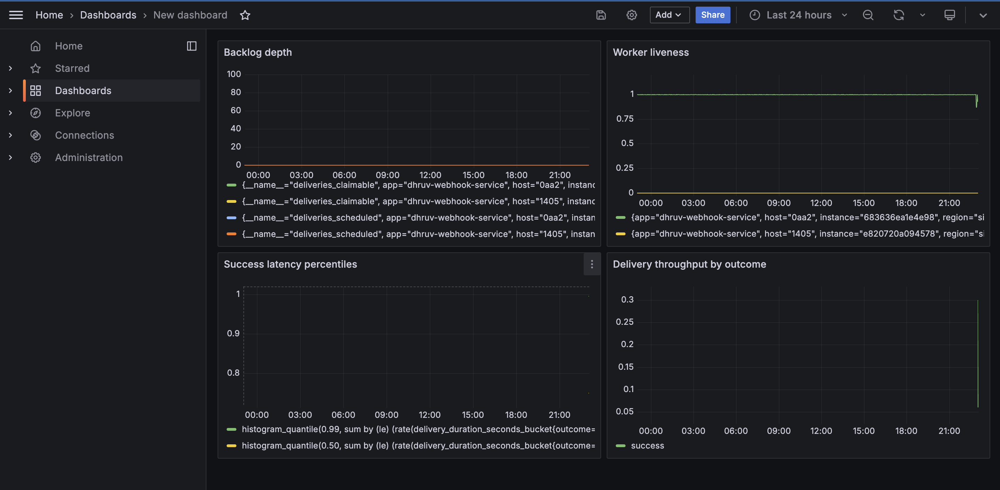

# Webhook Delivery Service

Ingests events and delivers them to subscriber endpoints over signed HTTP, with
retries, backoff, dead-letter handling, and circuit breaking. It's the same job
Stripe does when it POSTs an event to your endpoint.

The whole problem is that the receiver is out of our control — it can be down,
slow, or broken — so most of the code here is about delivering reliably anyway
rather than about the HTTP call itself.

## How it works

`POST /events` writes the event and one `Delivery` row per subscribed endpoint,
in a single transaction (transactional outbox). Workers poll the `deliveries`
table, claim due rows with `SELECT ... FOR UPDATE SKIP LOCKED`, sign and POST
them, and record what happened. There's no separate message broker — the
deliveries table *is* the queue, with `status` and `nextRetryAt` driving the
lifecycle.

```
POST /events -> API -> Postgres (deliveries = queue) -> worker xN -> subscriber
```

A delivery moves `PENDING → DELIVERING → DELIVERED`, or `→ FAILED` once it
either exhausts its retry budget or hits a terminal error (4xx, SSRF block, bad
scheme). Failed deliveries can be listed and redriven.

Code is organised as `routes → controllers → services → repositories`. The
services don't know about HTTP, which is why the worker and the `deliver:once`
script reuse the same delivery logic the API uses.

## Key design decisions

### Concurrency & scaling
- Workers claim jobs with `SELECT ... FOR UPDATE SKIP LOCKED`, distributing work
  across N workers with zero lock contention — no deadlocks, no duplicate
  delivery, and the backlog drains monotonically.
- Delivery writes are **batched**: one transaction per claimed batch (1
  `createMany` for attempt rows + per-row status updates + 1 commit) instead of
  one transaction per delivery. This cut database CPU ~80% (170% → 35%) and
  restored horizontal scaling — a second worker's throughput contribution rose
  from +10% to +48%.

### Fair scheduling
- A per-endpoint delivery sequence (`endpointSeq`) is assigned at creation and
  used as the primary sort key in the claim query. This produces round-robin-like
  interleaving from a plain indexed sort — a subscriber with 200k pending
  deliveries cannot block a low-volume subscriber's 5 deliveries.
- The fairness cost is paid once at write time (a counter increment on the
  endpoint row), keeping the claim path a cheap index scan.
- The natural expression of per-endpoint capping (a window function) is
  incompatible with `FOR UPDATE SKIP LOCKED` in Postgres; the write-time
  sequence sidesteps this constraint entirely.

### SSRF protection
- The service makes outbound requests to user-supplied URLs, making it an SSRF
  target. Defense is enforced at **connection time** via a custom `dns.lookup`
  hook that resolves, validates the IP against an exhaustive blocklist, and pins
  the vetted address — closing DNS rebinding and TOCTOU gaps.
- Blocklist covers loopback, private (RFC 1918), link-local, cloud metadata
  (169.254/16), CGNAT, multicast, unspecified, IPv6 equivalents, and
  IPv4-mapped IPv6 (`::ffff:127.0.0.1` → normalized before checking).
- Literal-IP URLs skip DNS resolution (and the hook), so a pre-request check
  catches that path separately.
- HTTPS is enforced in production; HTTP is gated behind a `ALLOW_HTTP_WEBHOOKS`
  flag for local development.
- Redirects are disabled entirely; 3xx is classified terminal.
- SSRF/scheme/malformed-URL failures are classified as **permanent** (terminal
  on attempt 1), not transient — so a poisoned URL doesn't burn the retry budget.

### Circuit breaker
- When an endpoint fails repeatedly, the breaker **opens** — excluding that
  endpoint's deliveries from being claimed at the query level, so workers don't
  waste time on a known-dead target.
- State is stored on the endpoint row (`failureCount`, `breakerOpenUntil`) and
  derived — no separate enum. Open means `breakerOpenUntil > NOW()`.
- The failure metric is a net delta (A′: failures − successes, floored at 0),
  because "consecutive failures" is undefinable in a distributed batched system.
- After a configurable cooldown, deliveries are readmitted (cooldown-then-
  readmit, not true half-open); if the endpoint is still dead, the burst fails
  and the breaker re-opens.

### Observability
- 

- Prometheus metrics on a private port: `deliveries_total{outcome}`,
  `delivery_duration_seconds` histogram, `deliveries_claimable` /
  `deliveries_scheduled` gauges, `worker_active_jobs`, `worker_poll_cycles_total`.
- Dashboarded in Grafana (via Fly.io managed Prometheus).
- Cross-process correlation IDs (`x-request-id` honoured or generated at
  ingestion, copied to deliveries, carried through retries via AsyncLocalStorage).

### Deployment
- Deployed to Fly.io as a single Docker image running separate API and worker
  process groups.
- Schema migrations gated as a pre-boot `release_command` (runs before new
  instances start).
- GitHub Actions CI runs integration tests against a real PostgreSQL 18
  container on every push.

## Stack

Node 22 (CommonJS), Express 5, PostgreSQL 18, Prisma 6, Zod 4, Pino, Jest +
Supertest, Docker Compose, Prometheus, Grafana, k6.

## Running it

```bash
cp .env.example .env
docker compose up -d          # Postgres, migrations, API, 2 workers, receiver
```

Register the example receiver and send an event:

```bash
# use http://receiver:4000 if the API runs inside compose,
# http://localhost:4000 if you run the API on the host with npm run dev
curl -s -X POST localhost:3000/endpoints -H 'Content-Type: application/json' \
  -d '{"url":"http://localhost:4000/webhook","eventTypes":["payment.succeeded"]}'

curl -s -X POST localhost:3000/events \
  -H 'Content-Type: application/json' -H 'Idempotency-Key: demo-1' \
  -d '{"eventType":"payment.succeeded","payload":{"amount":2000}}'

docker compose logs -f receiver
```

To run the app on the host with only Postgres in Docker:

```bash
npm install
docker compose up -d postgres
npm run prisma:migrate
npm run dev        # API
npm run worker     # worker, separate terminal
```

## Endpoints

- `POST /endpoints` — register a subscriber. Returns a `whsec_` signing secret,
  shown once.
- `POST /events` — ingest an event. Requires an `Idempotency-Key` header.
- `GET /deliveries?status=FAILED` — failed deliveries, filterable by
  `endpointId` and `failureReason`, cursor-paginated.
- `POST /deliveries/:id/redrive` — requeue one failed delivery.
- `POST /endpoints/:id/redrive` — requeue an endpoint's exhausted failures.
- `GET /health` — liveness plus a DB check.

## Signing

Each request carries `Webhook-Signature: t=<unix>,v1=<hmac>` and a `Webhook-Id`.
The signed string is `${timestamp}.${rawBody}`, HMAC-SHA256 with the endpoint's
secret. A subscriber verifies against the raw request body (not a re-serialised
copy), checks the timestamp is recent to block replays, and compares in constant
time. `receiver/index.js` is a working reference implementation.

## Configuration

Config is read from the environment and validated with Zod at startup, so a bad
value fails the boot instead of surfacing later. `.env.example` lists everything;
the knobs that matter most:

| Variable | Default | Purpose |
|----------|---------|---------|
| `MAX_DELIVERY_ATTEMPTS` | 6 | Retries before dead-letter |
| `BACKOFF_BASE_MS` | 1000 | Exponential backoff base |
| `BACKOFF_CAP_MS` | 3600000 | Maximum backoff delay |
| `WEBHOOK_TIMEOUT_MS` | 10000 | Per-delivery HTTP timeout |
| `WORKER_BATCH_SIZE` | 5 | Deliveries claimed per poll cycle |
| `WORKER_IDLE_POLL_MS` | 1000 | Poll interval when no work |
| `BREAKER_FAILURE_THRESHOLD` | 5 | Net failures before breaker opens |
| `BREAKER_COOLDOWN_SECONDS` | 30 | How long breaker stays open |
| `SSRF_ALLOW_LOOPBACK` | false | Permit loopback in dev/test |
| `ALLOW_HTTP_WEBHOOKS` | false | Permit http:// in dev/test |

## Tests

```bash
npm test
```

Integration tests run against a real PostgreSQL instance rather than mocks,
because the parts most likely to break are in SQL — the `SKIP LOCKED` claim, the
cursor comparison, the breaker-exclusion join, and the redrive queries. Test
coverage includes:

- **Ingestion** — idempotent event creation, fan-out, duplicate rejection.
- **Signatures** — HMAC-SHA256 signing and constant-time verification.
- **Backoff** — exponential schedule with jitter, retry-after header support.
- **Redrive** — dead-letter requeue for individual deliveries and per-endpoint
  bulk redrive.
- **SSRF blocklist** — exhaustive table-driven test covering IPv4, IPv6,
  IPv4-mapped IPv6, metadata, private ranges, loopback, and public addresses,
  run under both `allowLoopback: true` and `allowLoopback: false` to prove the
  flag works in both directions.
- **Circuit breaker** — claim exclusion for open-breaker endpoints, readmission
  after cooldown, breaker opening/not-opening based on failure threshold.
- **Fair scheduling** — interleaving verification (minnow served before whale
  backlog), index-scan confirmation via EXPLAIN.

## Load test findings

See [`loadtest/results/load-test-findings.md`](loadtest/results/load-test-findings.md)
for the full characterisation: ingestion capacity (~720 events/sec, Postgres-CPU-
bound), delivery throughput (baseline ~1,090/s → optimised ~1,280/s across two
workers at 65% DB CPU), the batching optimisation rationale, fairness validation,
and SSRF/circuit-breaker validation.

## Notes and limitations

- Delivery is at-least-once, not exactly-once. When a worker dies mid-delivery
  the reaper can't tell whether the request already reached the subscriber, so
  it re-delivers. Subscribers should dedupe on `Webhook-Id`.
- The fan-out query filters on array membership, which can't use a plain B-tree
  index. At scale it needs a GIN index on `endpoints.eventTypes`.
- Postgres-as-a-queue is fine for typical web throughput. A dedicated broker
  only becomes worth it at very high sustained rates or for fan-out patterns
  this isn't built for.